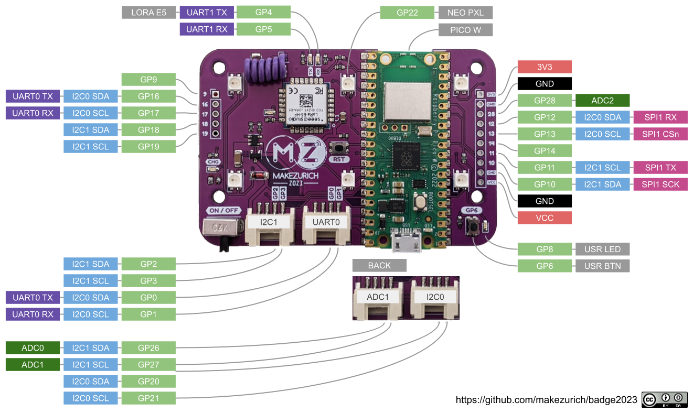

## Badge 

## Pinout

## Design 
* Sandwich
* LEDs shine trough the board
* Different SAO Addons for the different roles
* Resistors allow the badge to detect which role is plugged in

## PSU
* Adafruit Feather LiPo circuit

## IO
* LoRa E5
* Shitty Addon
* Cover connectors 
* Grove connectors

## Resources

### CircuitPython
https://www.circuitpython.org

https://github.com/todbot/circuitpython-tricks

### LoRa E5
https://wiki.seeedstudio.com/Grove_LoRa_E5_New_Version/

https://www.hackster.io/sidikalamini/grove-lora-e5-p2p-communication-using-circuitpython-f970e6

https://files.seeedstudio.com/products/317990687/res/LoRa-E5%20AT%20Command%20Specification_V1.0%20.pdf

#### Version
| title | date | author | id | mainfont | toc | toc-depth |
| --- | --- | --- | --- | --- | --- | --- |
|"Badge"|2022-09-20|Tillo|20220920183855|Cochin|true|2|
|"Badge"|2023-04-24|Fede|?|Cochin|true|2|
|"Badge"|2023-05-12|Fede|?|Cochin|true|2|
