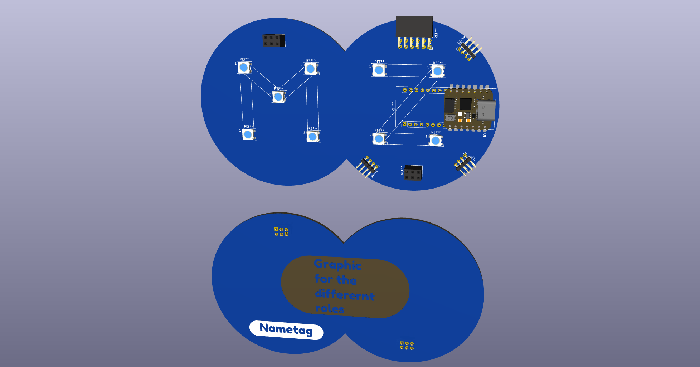
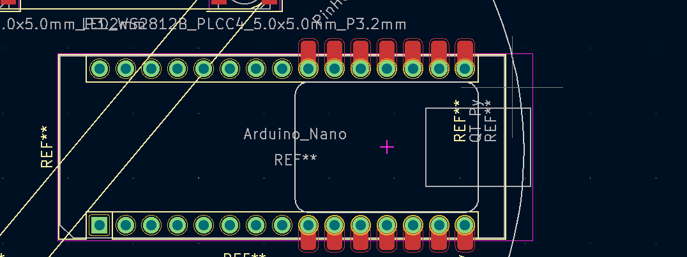

## Badge 20.9.

## MCU
* Raspi Pico W

## Design 
* Sandwich
* LEDs shine trough the board
* Different graphics for the different roles 
* Touch button on the top 
* Resistors allow the badge to detect which role is plugged in

## PSU
* Same battery as last year
* Maybe ask the participants to bring their battery

## IO
* Shitty Addon
* Grove

## Prototyping area
* It was so nice let's do it twice

##  Open questions
* Batteries ?
* Shape ?
* Artwork ?
* Sponsors ? 
* µC 